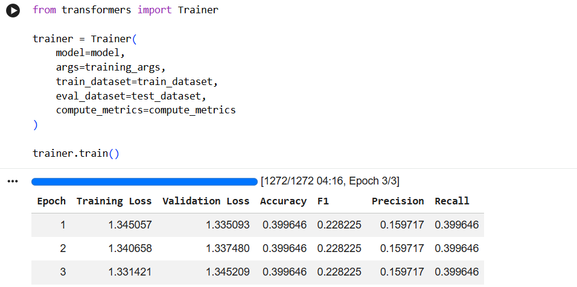
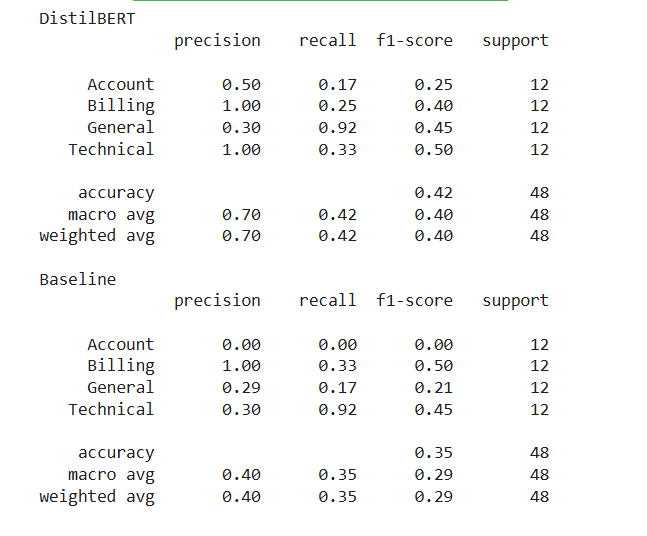
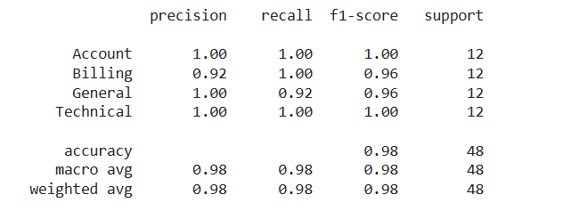
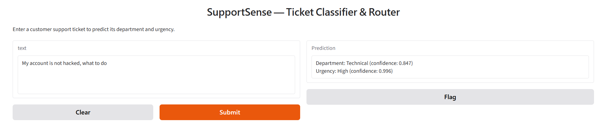

# SupportSense — AI-Powered Customer Support Ticket Classifier & Auto-Router

SupportSense takes a raw customer support ticket and predicts **which department** should handle it (Billing, Technical, Account, General) and **how urgent** it is (High, Medium, Low), using a fine-tuned DistilBERT model. It's built to route tickets automatically instead of relying on manual triage.

**[Live demo](#) — replace with your Hugging Face Spaces / Gradio link** · **[Training notebook](notebook/SupportSense_Training.ipynb)**


---

## Why this project is more than "fine-tuned a model and it worked"

Most beginner NLP projects report one accuracy number and stop. This one doesn't, because the first version of this model was **wrong in a way that still scored 40% accuracy** — and finding that, proving it, and fixing it is the actual point of this repo. The short version:

1. Trained a department classifier on the dataset's built-in category labels → stuck at **39.9% accuracy for all 3 epochs**, no matter what.
2. Investigated instead of assuming the model was broken — discovered the *labels themselves* didn't correlate with the ticket text at all (this dataset is synthetically generated, with text and categories paired close to randomly).
3. Fixed it by building my own labels from keyword rules grounded in the actual ticket text, re-trained → **99.8% accuracy**.
4. Got suspicious of *that* number too. Built a classical ML baseline (TF-IDF + Logistic Regression) and a held-out set of 48 hand-written tickets using none of the original keywords.
5. Both models collapsed on the new wording (DistilBERT: 42%, baseline: 35%) — proof the first "fix" had just taught the model to imitate my keyword rules, not understand tickets.
6. Fixed *that* by adding ~40 small, keyword-free, hand-written examples into training — re-tested on the same 48 tickets → **98%**. Repeated the same process for urgency (33% → 94%).

Full details, screenshots, and numbers below.

---

## What it does

| Input | Output |
|---|---|
| `"My laptop screen keeps flickering and won't stay on."` | Department: **Technical** (1.00) · Urgency: **High** (0.90) |
| `"I was charged twice for the same order this month."` | Department: **Billing** (1.00) · Urgency: **High** (0.96) |

Try it in the [live demo](#), or run the notebook end to end.

---

## Tech stack

- **Model:** `distilbert-base-uncased` (Hugging Face Transformers), fine-tuned with PyTorch
- **Tokenization:** Hugging Face `AutoTokenizer`, WordPiece subword tokenization, max length 128
- **Training:** Hugging Face `Trainer` API
- **Baseline comparison:** TF-IDF + Logistic Regression (scikit-learn)
- **Demo:** Gradio
- **Data:** [Customer Support Ticket Dataset](https://www.kaggle.com/datasets/suraj520/customer-support-ticket-dataset) (Kaggle, CC0-1.0), 8,469 tickets

---

## Pipeline

1. **Data cleaning & relabeling.** The dataset ships with a `Ticket Type` field and 5 categories; I remapped these into 4 target departments (Billing, Technical, Account, General) based on business logic (e.g., refunds and billing inquiries both fold into Billing, since both are money-related).
2. **Urgency labels from scratch.** No urgency field existed, so I built one using keyword rules (e.g., "urgent", "not working", "down" → High). Caught and fixed a bug where the word "issue" appeared in 92% of all tickets, silently making almost everything "Medium" — verified with frequency counts before trusting any keyword.
3. **Tokenization.** DistilBERT's tokenizer, `max_length=128` chosen from the real token-length distribution (median 73, 75th percentile 77).
4. **Train/test split.** 80/20, stratified on department labels.
5. **Fine-tuning.** 3 epochs, batch size 16, via Hugging Face `Trainer`.
6. **The department bug.** First training run: accuracy stuck at exactly 39.9646% for all 3 epochs — the model had learned to always predict "Billing" (the majority class) and nothing else.

   

   Root cause, confirmed with a crosstab of `Ticket Subject` vs. department: the dataset's category labels showed almost no relationship to the actual ticket text (e.g., "Hardware issue" tickets were spread nearly evenly across all 4 departments instead of clustering in Technical). The dataset is synthetically generated — text and category were paired close to randomly.
7. **The fix: text-grounded relabeling.** Rebuilt department labels using keyword rules derived from the ticket text itself (money words → Billing, device/software words → Technical, login/cancel words → Account), verified each keyword's frequency first to avoid repeating the "issue" mistake. Re-trained: **99.8% accuracy.**
8. **Sanity-checking the 99.8%.** Built a TF-IDF + Logistic Regression baseline on the identical train/test split, and a 48-ticket hand-written test set that deliberately avoids every keyword used in the labeling rules.

   

   Both models collapsed on tickets phrased differently — DistilBERT dropped from 99.8% to **42%**, the baseline to **35%**. Error analysis showed DistilBERT was defaulting to "General" whenever no familiar keyword appeared, and the baseline was defaulting to "Technical" (its largest training class). Neither model had learned the *concept* of a billing problem — only the specific words used to describe one during training.
9. **The second fix: small-scale data augmentation.** Added ~40 new hand-written, keyword-free examples directly into the training set (separate from the 48-ticket test set, which stayed untouched) and re-trained.

   

   Department: 42% → **98%** on the same 48 tickets. Urgency: 33% → **94%** on a parallel 18-ticket test, using the identical method.
10. **Saved, wrapped in an inference function, deployed as a Gradio demo.**

---

## Results

| Model | Standard test set (20% holdout) | Held-out probe set (new wording, no training keywords) |
|---|---|---|
| Department — before fix | 39.9% (always predicted Billing) | — |
| Department — after label fix | **99.8%** | 42% |
| Department — after augmentation | 99.6% | **98%** (48 tickets) |
| Urgency — after label fix | 99% | 33% |
| Urgency — after augmentation | 99.1% | **94%** (18 tickets) |
| Baseline (TF-IDF + LogReg) | 94% | 35% (48 tickets) |

**Read this table carefully, because the headline numbers are not the real story.** The probe sets are small (18–48 examples), so treat them as a directional signal, not a precise accuracy figure — a 50+ point swing is too large to be noise, but "98%" on 48 tickets shouldn't be quoted with the same confidence as "98%" on a few thousand. The real finding is the *gap* between the two columns, and what closing it took.

---

## Known limitations

- **Negation isn't reliably handled.** *"My account is hacked, what to do"* and *"My account is not hacked, what to do"* produce nearly identical predictions (both Technical, both High urgency, similar confidence) — the model isn't registering that "not" inverts the meaning.

  
  

- **Vocabulary is domain-specific to consumer tech support.** Business/seller terminology (e.g., "account manager" meaning a person, not a login) is misread — predicted General instead of Account, since the model only ever saw "account" used to mean a user login during training.

  

- **No shipping/logistics category.** The dataset only defines 4 departments; delivery-related tickets get forced into the closest fit (usually General or Billing), which may not match a real company's team structure.
- **Probe sets are small.** 18–48 hand-written examples is enough to detect a large effect, not enough to produce a precise, general accuracy number.
- **Labels are partly rule-derived, not human-annotated.** Even after augmentation, both models were trained on a mix of rule-based and hand-written labels rather than ground truth from real support agents. On a company's actual historically-routed tickets, I'd expect performance to land somewhere between the "before" and "after" probe numbers above.

---

## What I'd do with more time / in production

- Fine-tune on a company's own historically agent-routed tickets instead of rule-derived labels, which would let the model learn real routing patterns instead of approximating hand-written rules.
- Add a confidence threshold: auto-route only high-confidence predictions, send the rest to a human triage queue.
- Roll out in shadow mode first (predict without acting), then assisted mode (suggest, human confirms), before full automation.
- Expand the augmentation set specifically for negation and domain-specific vocabulary, which are the two concrete weaknesses found above.
- Add a 5th "Shipping/Logistics" category, since several test tickets didn't cleanly fit the original four.
- Wrap the inference function in a FastAPI service and connect it to a helpdesk tool (Zendesk/Freshdesk) via webhook for real automatic routing.

---

## Running it yourself

```bash
pip install -r requirements.txt
python demo/app.py
```

Or open `notebook/SupportSense_Training.ipynb` in Google Colab (GPU runtime recommended) to reproduce training end to end. Trained model weights are not included in this repo due to size — running the notebook regenerates them, or see [link to Hugging Face Hub if uploaded].

---

## Project structure

```
supportsense/
├── README.md
├── notebook/
│   └── SupportSense_Training.ipynb   # full pipeline, every step, every bug and fix
├── demo/
│   └── app.py                         # Gradio demo
├── Screenshots/
└── requirements.txt
```
